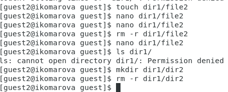

# Презентация к лабораторной работе 3.
## Дискреционное разграничение прав в Linux. Два пользователя

## Выполнила студентка группы НФИбд-02-19: Комарова Ирина Сргеевна 1032192866

## Задание
    Получение практических навыков работы в консоли с атрибутами файлов для групп пользователей.

## Теоретическое введение
В Linux, как и в любой многопользовательской системе, абсолютно естественным образом возникает задача разграничения доступа субъектов — пользователей к объектам — файлам дерева каталогов.

Один из подходов к разграничению доступа — так называемый дискреционный (от англ, discretion — чье-либо усмотрение) — предполагает назначение владельцев объектов, которые по собственному усмотрению определяют права доступа субъектов (других пользователей) к объектам (файлам), которыми владеют.

Дискреционные механизмы разграничения доступа используются для разграничения прав доступа процессов как обычных пользователей, так и для ограничения прав системных программ в (например, служб операционной системы), которые работают от лица псевдопользовательских учетных записей.

Назначаются владельцы файлов при их создании — обычно пользователем — владельцем файла становится пользователь, создавший файл, а группой — владельцем файла становится его первичная группа.

Изменяются пользователь — владелец файлов только суперпользователем root при помощи команды chown, а группа-владелец — владельцем файла в при помощи команды chgrp, но только на ту, к которой он сам принадлежит.

## Ход работы.
1. В прошлой лабораторной работе уже был создан пользователь guest. Приступила к созданию второго. 
2. Создала учётную запись пользователя guest2 командой: useradd guest2
3. Зада пароль для пользователя guest2: passwd guest2

4. Добавила пользователя guest2 в группу guest:
gpasswd -a guest2 guest

5. Осуществила вход в систему от двух пользователей на двух разных консолях: guest на первой консоли и guest2 на второй консоли.

6. Для обоих пользователей командой pwd определила директорию, в которой нахожусь.
7. Уточнила имя пользователя, его группу, кто входит в неё и к каким группам принадлежит он сам. Определила командами groups guest и groups guest2, в какие группы входят пользователи guest и guest2. Сравнила вывод команды groups с выводом команд
id -Gn и id -G.

8. Сравнила полученную информацию с содержимым файла /etc/group командой
cat /etc/group

9. От имени пользователя guest2 выполнила регистрацию пользователя
guest2 в группе guest командой
newgrp guest

10. От имени пользователя guest изменила права директории /home/guest,
разрешив все действия для пользователей группы:
chmod g+rwx /home/guest

11. От имени пользователя guest сняла с директории /home/guest/dir1
все атрибуты командой
chmod 000 dirl
12. Заполнила таблицу с минимальными требуемыми правами.

## Вывод 
    Я получила практические навыки работы в консоли с атрибутами файлов для групп пользователей.

## Библиография
1. Методические материалы курса. “Информационная безопасность компьютерных сетей” Кулябов Д. С.,Королькова А. В., Геворкян М. Н.